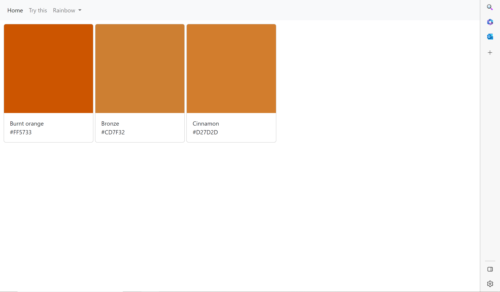
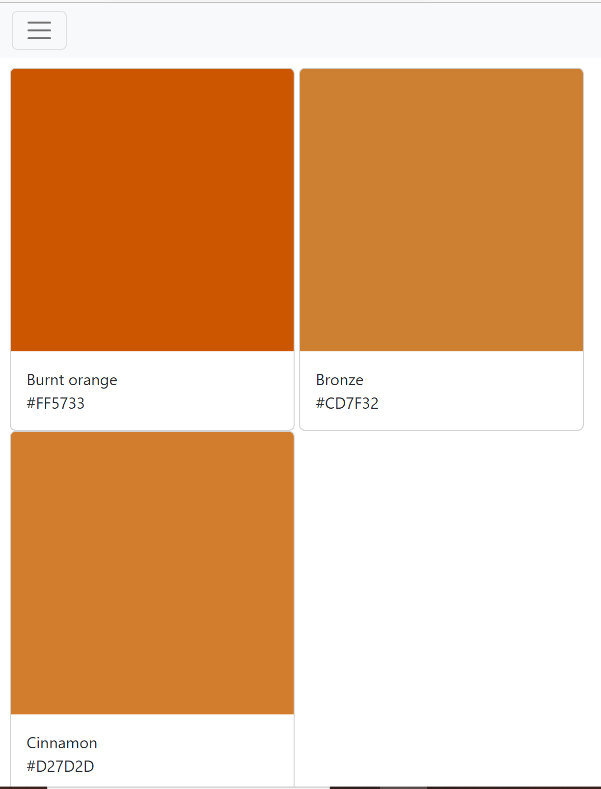
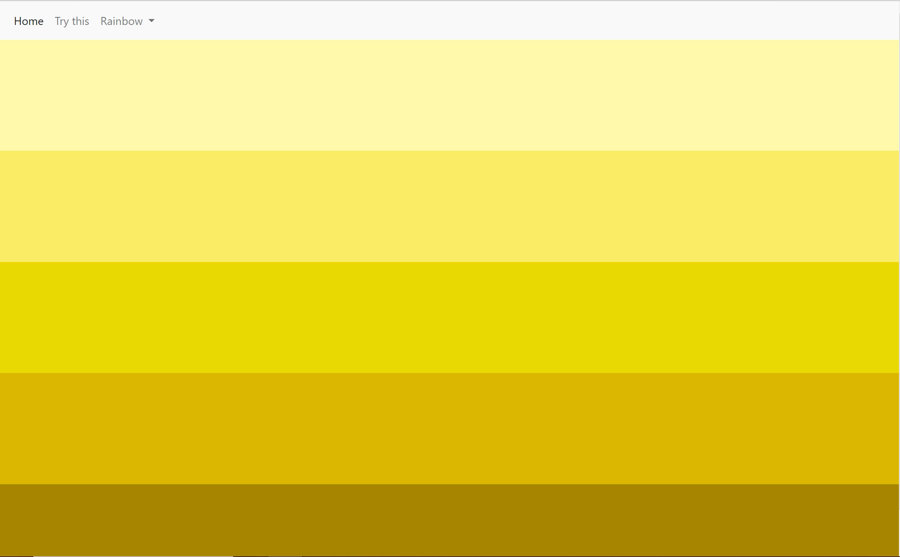
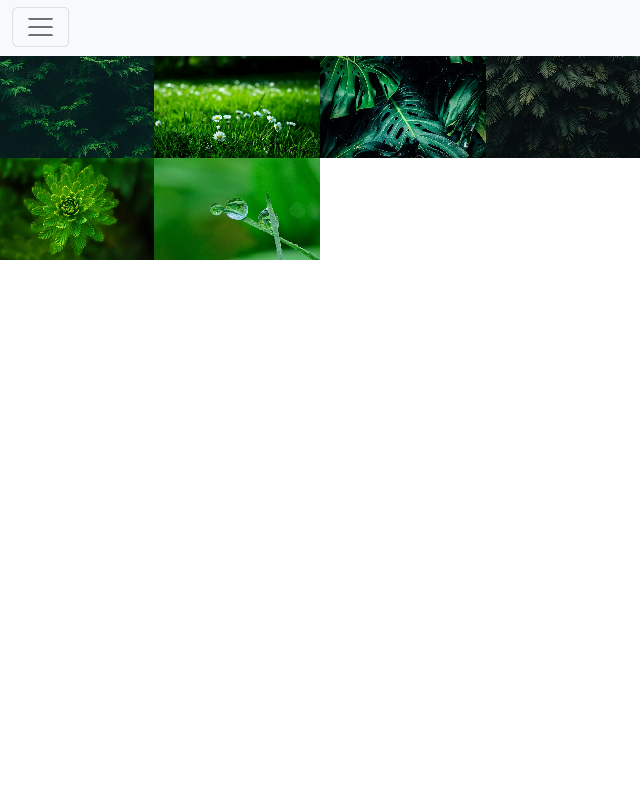
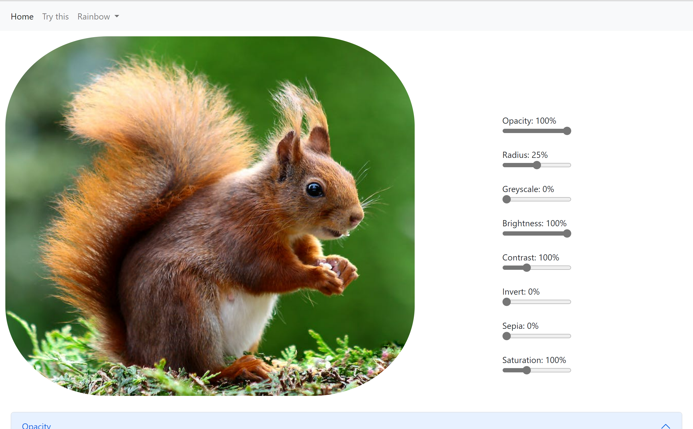
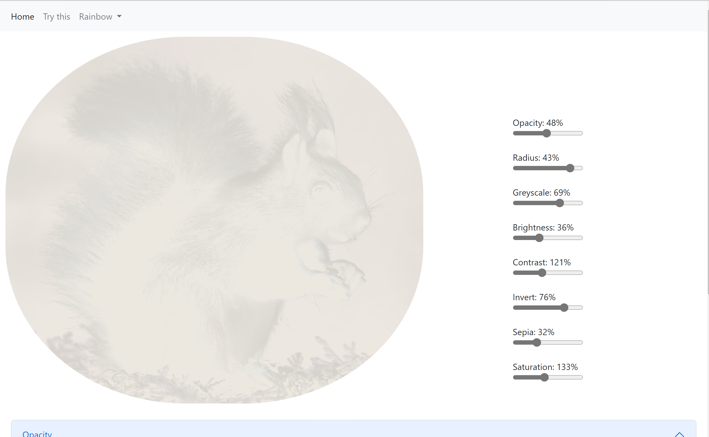
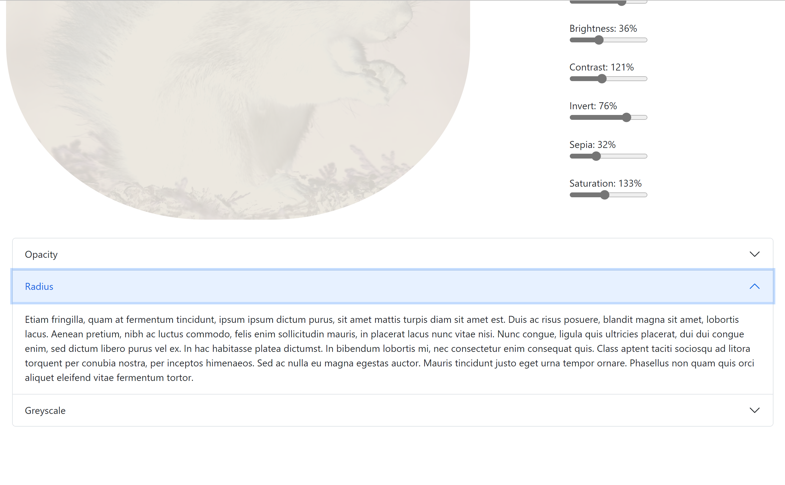

# Responsiveness Using Bootstrap

**Purpose:** Class assignment  
**Link:** https://responsivenessupload.josephinemouse.repl.co/

This was an assignment to make a responsive photo-display website. I decided to take the opportunity to experiment with as many photo effects as I could. Unfortunately the photo editor didn't end up being very responsive, but I've used the basic idea of the photo editor in another project with plans to make it better.

_Because of the animations, and because the site is centered around being responsive, it's hard to truly show the site in photos._

